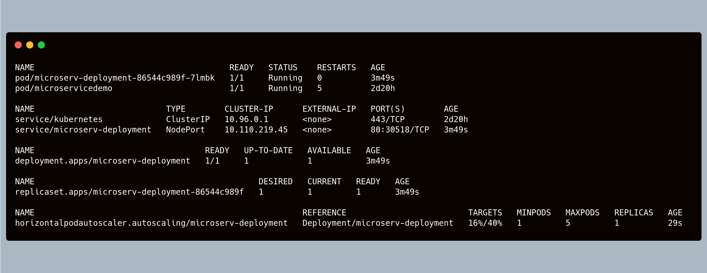
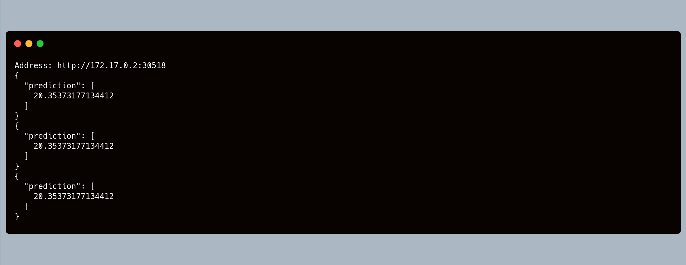
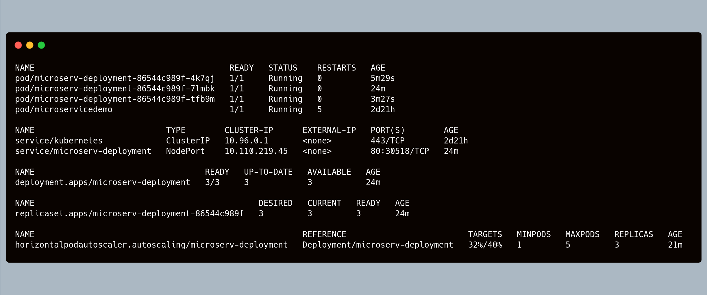

# Udacity Cloud DevOps Nanodregree 2020
## Project 4: Operationalize a Machine Learning Microservice API

### Summary

We were given a pre-trained, sklearn model that was trained to predict housing prices in Boston according to several features, such as average rooms in a home and data about highway access, teacher-to-pupil ratios, and so on. You can read more about the data, which was initially taken from Kaggle, on the data <a href="https://www.kaggle.com/c/boston-housing">source site.</a>
The idea of the project was to test our abilities to operationalize a Python flask app — in a provided file, `app.py` — that serves out predictions (inference) about housing prices through API calls. This project could be extended to any pre-trained machine learning model, such as those for image recognition and data labeling. (Source: Udacity Project Description)

### Project Tasks

* Test the project code using linting.
* Complete a Dockerfile to containerize this application.
* Deploy the containerized application using Docker and make a prediction.
* Improve the log statements in the source code for this application.
* Configure Kubernetes and create a Kubernetes cluster.
* Deploy a container using Kubernetes and make a prediction.
* Upload a complete Github repo with CircleCI to indicate that your code has been tested.

### Extended Tasks

I added the following tasks to extend the app's functionalities:
* Create a Kubernetes Deployment and add a Service to it.
* Create a Horizontal Pod Autoscaler (HPA) associated with the Deployment.
* Test the autoscaling implementation under a heavy load of API calls.

---

### Running the containerized App

(<a href="https://docs.docker.com/get-docker/">Docker</a> is required)
1. Type `./run_docker.sh` in a terminal. This will build the Docker image for the app and launch a container, listening in port 8000.
2. Type `./make_prediction.sh` in a second terminal window. This will make an API call to produce a prediction.

### Running the App with Kubernetes

(<a href="https://kubernetes.io/docs/tasks/tools/install-minikube/">Minikube</a> and <a href="https://kubernetes.io/docs/tasks/tools/install-kubectl/">Kubectl</a> are required)
1. Type `minikube start` in a terminal to start a local cluster.
2. Type `./run_kubernetes.sh` to create a pod and run the containerized app, listening in port 8000.
3. Check the pod's status with a call to `kubectl get pod`
4. Once your pod is `Running`, make an API call in a second terminal window typing `./make_prediction.sh` 

### Autoscaling the App with Kubernetes and HPA

Once a cluster has been started (you can use the same from the instructions above):
1. Type `./run_deployment.sh` which will do several things: 
    * Create a Deployment with one (1) initial pod.
    * Create a Service associated with the deployment. This will give the app an endpoint to get API calls.
    * Enable metrics-server addon in Minikube. This will provide the necesary metrics to make the App scale.     
2. Type: `kubectl autoscale deployment microserv-deployment --cpu-percent=40 --min=1 --max=5`
   * This will create the Horizontal Pod Autoscaler (HPA) associated with the deployment.
   * There will be 1 to 5 pods in order to keep a 40% CPU usage across all pods.
3. Type `kubectl get all` to see all the resources that you've have created so far and their status. The picture below will be the information showed after some minutes and you should be able to see that everything is up and running with all the data from the metrics:

4. To get info specifically on the HPA, just type `kubectl get hpa` . You can do the same with other resources as well.
5. To test that everything is OK, make API calls by typing `./make_many_predictions.sh` in a second terminal window. This script will hit the endpoint provided by the Service and the output should be something like this: 

6. In the same second terminal window, type `while true; do ./make_many_predictions.sh; done`, which will run a loop of 3 API calls in order to increase CPU usage. Let the loop run. (You can always get out of the loop by typing `CTRL + C`). 
7. Go back to your first terminal window. Wait some minutes and check the status by typing `kubectl get hpa`. You'll see CPU usage has increased and new pods have been automatically deployed in order to meet the 40% target. Then, when everything is stable, this will be the output of typing `kubectl get all` with all the new pods up and running: 

8. Stop the loop by typing `CTRL + C`. Wait some minutes and check the HPA status with `kubectl get hpa` to see how the deployment scales down. Evetually it will get into the initial state of one (1) pod.
9. Finally, delete resources by typing `kubectl delete <RESOURCE> microserv-deployment`. Optionally, you can stop the cluster by typing `minikube stop`, and delete the entire cluster `minikube delete`

---

### File descriptions

(If you have a permission issue when executing .sh files, type `chmod +x <FILENAME>`)

* `Dockerfile`: Docker image configuration for the app.
* `Makefile`: Setup and environment configuration.
* `requirements.txt`: List of all app's dependecies.
* `app.py`: Python - Flask script for the app.
* `run_docker.sh`: Build app's Docker image and run a container to use the app.
* `upload_docker.sh`: Upload app's image to Docker Hub.
* `run_kubernetes.sh`:  Runs a Docker image in Kubernetes.
* `make_prediction.sh`: API call to test app.
* `run_deployment.sh`: Creates a deployment and a service in Kubernetes.
* `microservice_deployment.yaml`: Deployment's configuration.
* `make_many_predictions.sh`: API calls to test deployment.
* `.circleci` folder: Testing configuration with CircleCI. 
* `output_txt_files` folder: Output text from running the app.